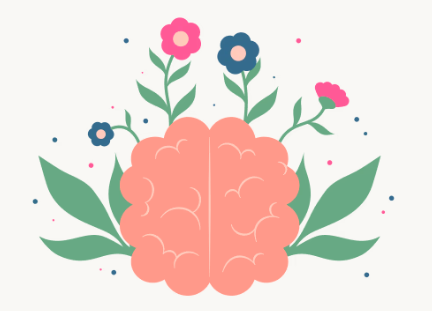
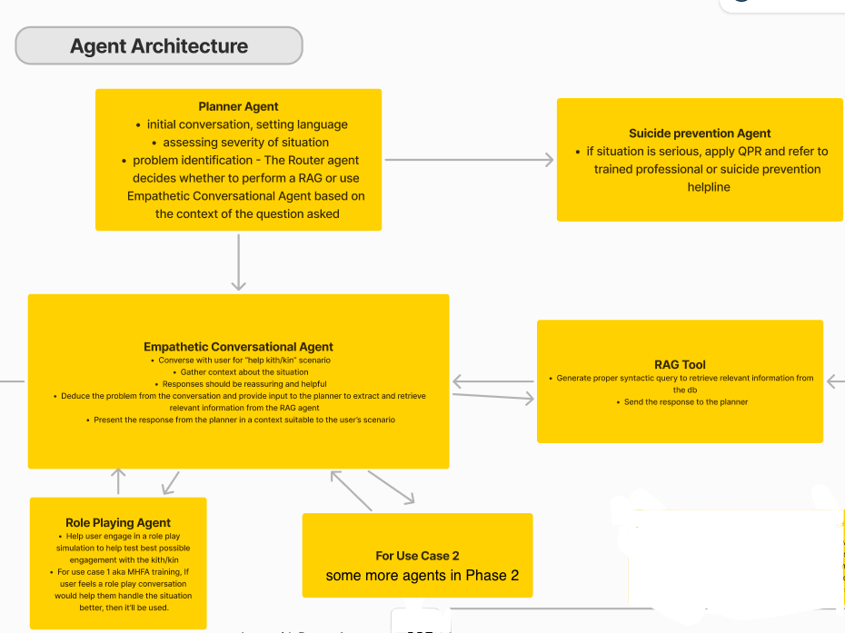
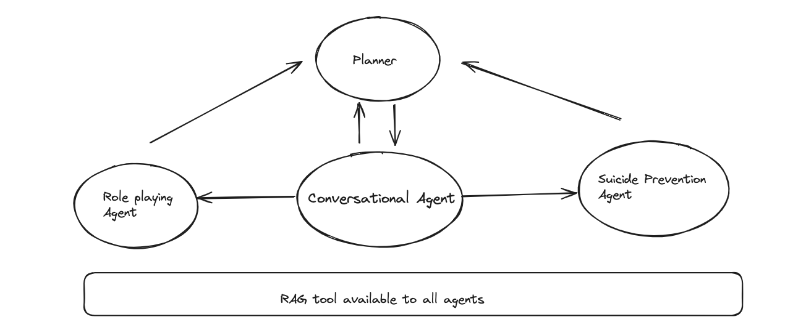

# Project Sukoon: Mental Health Support using AI


## Table of Contents

- [Vision](#vision)
- [Project Progress](#project-progress)
- [Installation](#installation)
- [Contributing](#contributing)
- [Documentation](#documentation)
- [Issues](#issues)
- [Pull Requests](#pull-requests)
- [Volunteer](#volunteer)

## Vision

Project Sukoon aims to build open-source solutions and standards for using AI to address mental health challenges. Our goal is to apply Digital Public Infrastructure (DPI) knowledge and practices to help professionals explore and understand the latest advancements in AI and their applications to mental health use-cases specific to India.

## 🚀 Project Progress

1. Prototyped with [Crew AI agent framework](https://www.crewai.com/)
2. Developed backend and frontend using [LangGraph framework](https://www.langchain.com/langgraph)
3. Shifted to [AutoGen framework](https://microsoft.github.io/autogen/docs/tutorial/introduction/) based on expert consultation
4. Currently addressing web UI issues and agent loop problems with AutoGen
5. Planning to create API endpoints for LangGraph and integrate with WhatsApp API
6. Conducting user testing using Gooey.ai, following the logic used in AutoGen and LangGraph prompts

[Watch the video](https://drive.google.com/file/d/1zFL8nz0d8aqzHxJhFU0h-ScDdFaSkPeT/view?usp=drive_link)

## Installation

### Technical Architecture


The main code is present in separate branches using different frameworks: AutoGen (from Microsoft Research) and LangGraph (from Langchain).

# LangGraph (Current Version)
```
- Go to langgraph branch
- install all dependencies in your environment (pip install -r requirements.txt)
- run 'python sukoon_api.py' 
- go to sukoon-frontend(cd sukoon-frontend), run 'npm start' to access it in your browser.
- alternatively use this vercel deployment to access it - https://sukoon-1.vercel.app
```

Fig 2: 

# AutoGen
```
- Go to autogen branch
- install all dependencies in your environment (pip install -r requirements.txt)
- run 'python app.py' 
- Start interacting with AI agents
Note: if you're getting SQL Lite error, please open a github issue.
```

## Steps to add environment variables - 
Create a .env file with:
```
OPENAI_API_KEY = '<YOUR_OPENAI_API_KEY>' 
LANGCHAIN_API_KEY = '<YOUR_LANGCHAIN_API_KEY>'
```
- Alternatively , try this:
```
On Mac/Linux -
export OPENAI_API_KEY=your_api_key_here

On Windows -
setx OPENAI_API_KEY "your_api_key_here"
```

# How to contribute 🤝
There are few ways you can contribute to Sukoon

- By providing feedback on the POC
- By raising issues in the issues section
- By contributing to the codebase based on the issues
- Join the Sukoon team by filling the p+ai volunteer form (https://peopleplus.ai/volunteer) and select the Sukoon project.
- Submit PRs to the respective branches (e.g. 'autogen' or 'langgraph')

For detailed guidelines, please read the guidelines outlined in CONTRIBUTING.md

The docs folder contains overall project documentation and related documents. To access or contribute to the documentation, please refer to docs/README.md.
e.g Please read the main doc here and feel free to add comments here - https://docs.google.com/document/d/1H8-oJmMy0r28kYup9vqt8VGDlY_cCFW_2M07XJxWpFU/edit?usp=sharing 

## Issues

If you encounter any issues with the project, please create a new issue using the issue template. Provide as much detail as possible to help us understand and resolve the issue.

# Current Challenges
We have two active discussions:
```
Develop a PII Removal Module for a Mental Health Care WhatsApp Chatbot
Improving Central Orchestrator Agent Classification in AutoGen System
```

# Current Landscape
Mental health support in India faces several challenges:

* Stigma and discrimination
* Lack of awareness
* Shortage of trained mental healthcare personnel
* Affordability issues
* Low budget allocation for mental healthcare

# What could a solution look like? (Tentative features) 
* Very personal approach with focus on listening and emphasising
* Available in 22 Indic regional languages, especially on mobile devices
* Stores the user conversation locally, not on cloud -> ensuring complete privacy
* Will provide helpful resources for most common mental health problems. However, it'll not prescribe any medicines
* For training the bot , we can use federated learning
* Will be available as an API, so interested people can try this and build on top of it, based on their use case
* Aim is to get national-level adoption
* If serious, there’ll option to reach out to a psychiatrist or support community groups e.g. peer to peer network
* Have L1/L2/L3 level of support 

# Some interesting ideas to try: 
* Can we gamify the whole conversation? If yes, then how? 
* Can we nudge users to adopt healthier behaviour? 
* In particular, we can warn users about what not to do - relying on superstitions, isolation, labelling, and other unhelpful tactics
* Give positive self-affirmation, create safety plan, etc
* Can we develop Emotional Intelligence that understands not just emotions, but context behind it
* Can we detect emotional status ike stress level using voice(like hume) and then support him
* Can we create a timeline tracker let’s say six month plan for meditation and track streak
* Can we give them a phone number they can call to? The bot will mainly listen , empathize and offer safe advice

“Made for 🇮🇳 with ❤️ by People+AI”
