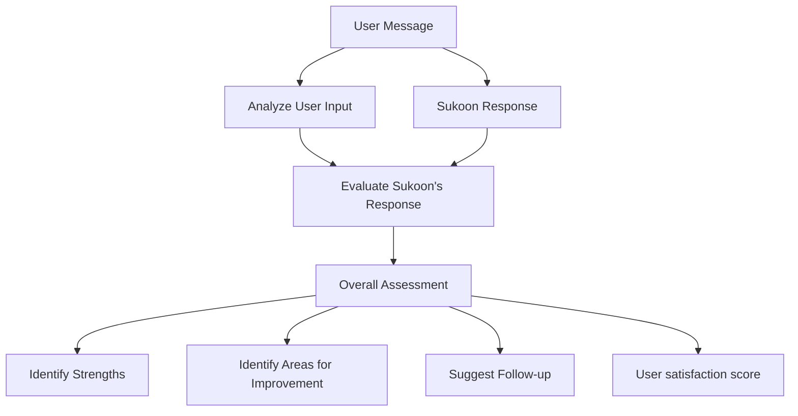

## Explanation of the Sukoon Chatbot Evaluation Process

### Purpose of Evaluation
We evaluate the Sukoon chatbot's responses to ensure it's providing helpful, empathetic, and appropriate support for users' mental health concerns. This process helps us improve the chatbot's performance over time.

### The Evaluation Process

1. **User Input Analysis**  
   We first look at what the user is saying to understand their needs.

   | Aspect            | Description                                      | Example                             |
   |-------------------|--------------------------------------------------|-------------------------------------|
   | Primary Concern    | The main mental health issue or emotional state  | Depression, anxiety, stress         |
   | Subject Category   | The type of support needed                       | Emotional support, coping strategies, crisis management |
   | Emotional Tone     | The overall mood of the user's message          | Sad, frustrated, hopeful            |

2. **Sukoon's Response Evaluation**  
   We then analyze how well Sukoon responded to the user's needs.

   | Criteria     | Description                                          | Scale | in_batches |
   |--------------|------------------------------------------------------|-------|------------|
   | Empathy      | How well Sukoon understood and acknowledged the user's feelings | 1-5   | No   |
   | Relevance    | How well Sukoon's response addressed the user's specific concern | 1-5   | Yes   |
   | Clarity      | How easy it was to understand Sukoon's response     | 1-5   | No   |
   | Helpfulness  | How useful Sukoon's suggestions or information were  | 1-5   | Yes   |

3. **Overall Assessment**  
   We identify strengths, areas for improvement, and suggest follow-up questions. Here we can also look at scores on user satisfaction to let us know if the current agent flow is suitable for the user.

### Visual Representation of the Process

### Why This Evaluation Matters

1. **Ensures Quality:** By consistently evaluating responses, we can maintain a high standard of support.
2. **Identifies Patterns:** We can spot recurring issues or exceptionally good responses.
3. **Guides Improvements:** The feedback helps us refine Sukoon's responses and capabilities.
4. **Enhances User Experience:** Better responses lead to more effective support for users.
5. **Safety Check:** We can ensure Sukoon is appropriately handling sensitive or crisis situations.

### Example Evaluation

**User:** "I've been feeling really anxious about my upcoming job interview. I can't sleep at night."

**Sukoon:** "I understand that job interviews can be stressful, and it's affecting your sleep. It's normal to feel anxious about important events. Have you tried any relaxation techniques like deep breathing or progressive muscle relaxation? These can help calm your mind and improve sleep. Also, preparing well for the interview might help boost your confidence. Would you like to explore some strategies to manage interview anxiety?"

#### Evaluation:
- **User Analysis:**
  - Primary Concern: Anxiety
  - Subject Category: Coping Strategies
  - Emotional Tone: Worried

- **Sukoon's Response Evaluation:**
  - Empathy Rating: 4/5
  - Relevance Rating: 5/5
  - Clarity Rating: 4/5
  - Helpfulness Rating: 4/5
  - Overall Rating: 4.25/5

- **Strengths:**
  1. Acknowledged the user's feelings
  2. Normalized the experience
  3. Offered specific coping strategies
  4. Provided a practical suggestion (interview preparation)

- **Areas for Improvement:**
  1. Could provide a specific deep breathing technique
  2. Might ask about the user's current preparation status

- **Suggested Follow-up:** "What steps have you already taken to prepare for your interview?"

By regularly performing this type of evaluation, we can ensure that Sukoon is providing the best possible support to users dealing with mental health concerns.